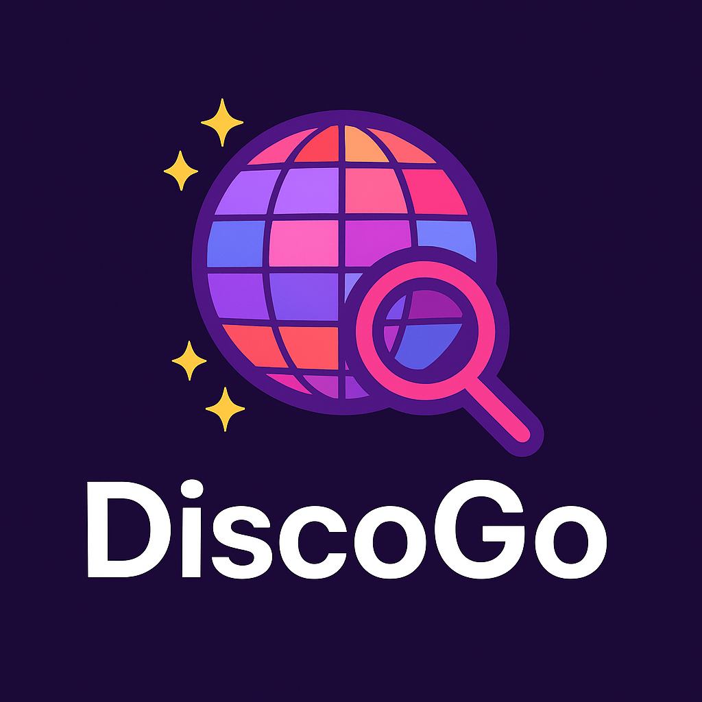

# DiscoGo

DiscoGo is a **cloud-native service discovery and health monitoring system** written in Go. Designed for modern distributed and microservices architectures, DiscoGo provides RESTful APIs for service registration, heartbeat, discovery, and deregistration, using Redis as a backend. It is optimized for deployment in cloud environments and container orchestration platforms such as Kubernetes, Docker Swarm, and other cloud providers.



## Cloud-Native Features

- **Cloud-ready**: Easily deployable on Kubernetes, Docker, or any cloud provider (AWS, GCP, Azure, etc.)
- **Stateless**: All state is managed in Redis, enabling horizontal scaling and high availability
- **Container-friendly**: Lightweight, fast startup, and minimal resource usage
- **Environment-based configuration**: Supports `.env` files and environment variables for seamless cloud integration
- **Health endpoints**: For both API and Redis, suitable for cloud-native health checks and readiness probes
- **Observability**: Logging and metrics can be integrated with cloud monitoring solutions

## Core Features

- Service registration with metadata
- Heartbeat endpoint for health checks
- Service discovery with filtering and pagination
- Deregistration of services
- Health check for API and Redis
- Swagger/OpenAPI documentation

## Project Structure

```
.
├── cmd/                # Application entrypoint
│   └── mian.go
├── docs/               # Swagger/OpenAPI docs
├── internal/
│   ├── api/            # HTTP API handlers, DTOs, validators
│   ├── config/         # Configuration loading
│   ├── logger/         # Logging utilities
│   ├── redis/          # Redis client and helpers
│   ├── service/        # Service startup logic
│   └── utils/          # Utility functions
├── shared/             # Shared assets (architecture diagram, etc.)
├── conf.json           # Service types and providers config
├── .env                # Environment variables (development)
├── .env-prod           # Environment variables (production)
├── go.mod
├── go.sum
└── README.md
```


## Getting Started


### Prerequisites

- Go 1.25+
- Redis server (cloud-managed Redis services are supported, e.g., AWS ElastiCache, Azure Redis, Google Memorystore)
- (Optional) Docker, Kubernetes, or any container orchestration platform


### Setup

1. Clone the repository.
2. Copy `.env` or `.env-prod` and adjust environment variables as needed for your cloud or local environment.
3. Install dependencies:

   ```sh
   go mod tidy
   ```

4. Run the application locally:

   ```sh
   go run ./cmd/mian.go
   ```

5. (Optional) Build and run with Docker:

   ```sh
   docker build -t discogo .
   docker run --env-file .env -p 8080:8080 discogo
   ```

6. (Optional) Deploy to Kubernetes:

   - See `docs/` for example Kubernetes manifests and Helm charts (coming soon)


### API Documentation

Swagger UI is available at `/swagger/index.html` when the server is running.


## Main Endpoints

- `POST /disco/register` — Register a new service
- `POST /disco/heartbeat/{uuid}` — Send heartbeat for a service
- `GET  /disco/discover` — Discover services
- `POST /deregister` — Deregister a service
- `GET  /disco/health` — Health check
- `GET  /disco/version` — Version info


## Configuration

- Service types and providers are defined in [`conf.json`](conf.json).
- Environment variables are loaded from `.env` or `.env-prod`.
- Supports cloud environment variables and secret management (e.g., Kubernetes Secrets, AWS Parameter Store)

## Cloud Deployment Examples

- **Docker Compose**: Use `docker-compose.yml` to run DiscoGo and Redis together for local development or simple cloud deployments.
- **Kubernetes**: Deploy DiscoGo as a Deployment and expose via a Service. Use ConfigMaps and Secrets for configuration.
- **Cloud Redis**: Point your configuration to a managed Redis instance for production-grade reliability.

## License

MIT